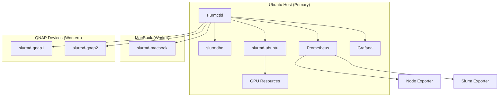
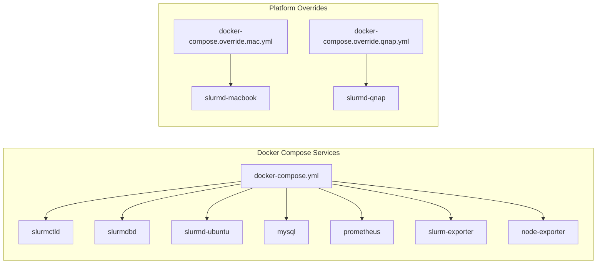
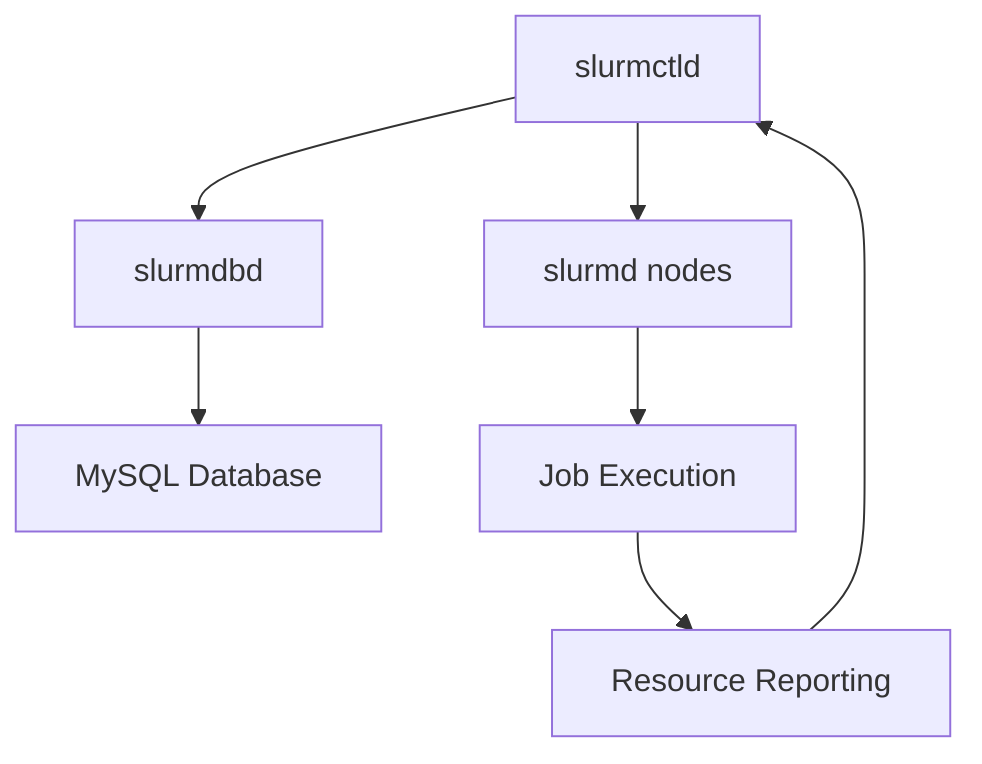
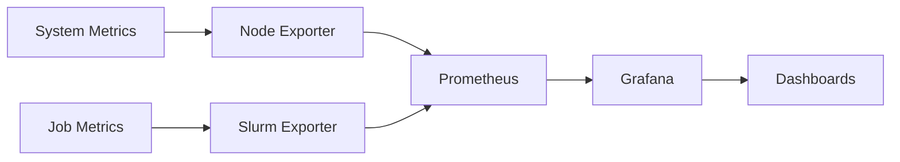
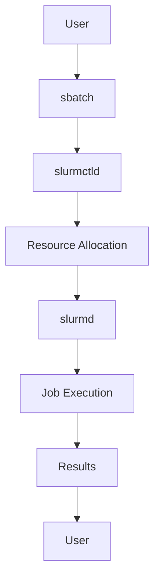

# System Patterns: Slurm Cluster Architecture

## Architecture Overview

### High-Level Architecture



### Container Architecture



## Key Technical Decisions

### 1. Containerization Strategy

#### Decision: Docker-based Deployment
- **Rationale**: Consistent environment across heterogeneous hardware
- **Benefits**: 
  - Platform independence
  - Easy deployment and updates
  - Isolated dependencies
- **Trade-offs**:
  - Performance overhead
  - Cgroup compatibility issues
  - Systemd limitations

#### Decision: Docker Compose Orchestration
- **Rationale**: Multi-service management and networking
- **Benefits**:
  - Service discovery
  - Shared networks
  - Volume management
- **Implementation**: `docker-compose.yml` with platform-specific overrides

### 2. Authentication Strategy

#### Decision: Munge Key-based Authentication
- **Rationale**: Slurm's standard authentication mechanism
- **Benefits**:
  - No external dependencies
  - Simple key distribution
  - Secure communication
- **Implementation**: Shared `munge.key` across all nodes

### 3. Configuration Management

#### Decision: Bind-mounted Configuration
- **Rationale**: Easy updates without rebuilding containers
- **Benefits**:
  - Runtime configuration changes
  - Version control integration
  - No container rebuilds needed
- **Implementation**: `./shared/` directory mounted in all containers

### 4. Monitoring Architecture

#### Decision: Prometheus + Grafana Stack
- **Rationale**: Industry standard for containerized applications
- **Benefits**:
  - Rich metrics collection
  - Flexible visualization
  - Alerting capabilities
- **Components**:
  - Prometheus: Metrics collection
  - Grafana: Visualization
  - Node Exporter: System metrics
  - Slurm Exporter: Job metrics

## Design Patterns

### 1. Service Discovery Pattern

```yaml
# docker-compose.yml
services:
  slurmctld:
    hostname: slurmctld
    networks:
      - slurm-net
  
  slurmd-ubuntu:
    depends_on:
      - slurmctld
    networks:
      - slurm-net
```

**Pattern**: Service names as hostnames for internal communication
**Benefits**: Automatic DNS resolution within Docker network

### 2. Configuration Injection Pattern

```yaml
# docker-compose.yml
services:
  slurmctld:
    volumes:
      - ./shared:/etc/slurm:ro
```

**Pattern**: Bind-mounted configuration files
**Benefits**: Runtime configuration updates without container rebuilds

### 3. Health Check Pattern

```bash
# entrypoint.sh
while ! nc -z slurmctld 6817; do
  echo "Waiting for slurmctld..."
  sleep 2
done
```

**Pattern**: Service dependency checking
**Benefits**: Robust startup sequence and error handling

### 4. Platform Abstraction Pattern

```yaml
# docker-compose.override.mac.yml
services:
  slurmd-macbook:
    platform: linux/amd64
    volumes:
      - /tmp:/tmp
```

**Pattern**: Platform-specific overrides
**Benefits**: Single codebase with platform-specific optimizations

## Component Relationships

### 1. Slurm Core Components



### 2. Monitoring Data Flow



### 3. Job Execution Flow



## Error Handling Patterns

### 1. Graceful Degradation

```bash
# Current approach: Disable cgroup functionality
ProctrackType=proctrack/linuxproc
# TaskPlugin= (disabled for Docker compatibility)
```

**Pattern**: Accept limitations for compatibility
**Benefits**: Functional system with reduced features

### 2. Retry Logic

```bash
# entrypoint.sh
for i in {1..30}; do
  if nc -z slurmctld 6817; then
    break
  fi
  sleep 2
done
```

**Pattern**: Exponential backoff with maximum attempts
**Benefits**: Robust startup in dynamic environments

### 3. Logging Strategy

```bash
# Docker logging configuration
logging:
  driver: "json-file"
  options:
    max-size: "10m"
    max-file: "3"
```

**Pattern**: Structured logging with rotation
**Benefits**: Debugging and monitoring capabilities

## Security Patterns

### 1. Authentication

```bash
# Munge key distribution
cp munge.key shared/
chmod 600 shared/munge.key
```

**Pattern**: Shared secret authentication
**Benefits**: Simple, secure node-to-node communication

### 2. Network Isolation

```yaml
# Docker network configuration
networks:
  slurm-net:
    driver: bridge
    internal: true
```

**Pattern**: Isolated network for cluster communication
**Benefits**: Security through network isolation

### 3. Resource Limits

```yaml
# Container resource constraints
services:
  slurmd-ubuntu:
    deploy:
      resources:
        limits:
          memory: 2G
```

**Pattern**: Container-level resource limits
**Benefits**: Prevent resource exhaustion

## Performance Patterns

### 1. Resource Detection

```bash
# Automatic GPU detection
if nvidia-smi >/dev/null 2>&1; then
  echo "GPU detected"
  # Configure GPU resources
fi
```

**Pattern**: Runtime resource detection
**Benefits**: Automatic configuration based on available hardware

### 2. Load Balancing

```yaml
# Slurm partition configuration
PartitionName=debug Nodes=ALL Default=YES MaxTime=00:10:00
PartitionName=gpu Nodes=ubuntu MaxTime=24:00:00
```

**Pattern**: Partition-based resource allocation
**Benefits**: Efficient resource utilization

### 3. Caching Strategy

```yaml
# Prometheus configuration
global:
  scrape_interval: 15s
  evaluation_interval: 15s
```

**Pattern**: Regular metrics collection
**Benefits**: Real-time monitoring with reasonable overhead

## Deployment Patterns

### 1. Multi-Environment Support

```bash
# Platform-specific deployment
case $PLATFORM in
  "macbook")
    docker compose -f docker-compose.yml -f docker-compose.override.mac.yml up -d
    ;;
  "qnap")
    docker compose -f docker-compose.yml -f docker-compose.override.qnap.yml up -d
    ;;
esac
```

**Pattern**: Environment-specific configurations
**Benefits**: Single codebase, multiple deployment targets

### 2. Blue-Green Deployment

```bash
# Rolling update strategy
docker compose down
docker compose pull
docker compose up -d
```

**Pattern**: Zero-downtime updates
**Benefits**: Continuous availability during updates

---

*This system patterns document captures the architectural decisions, design patterns, and component relationships that define the Slurm Cluster implementation.* 